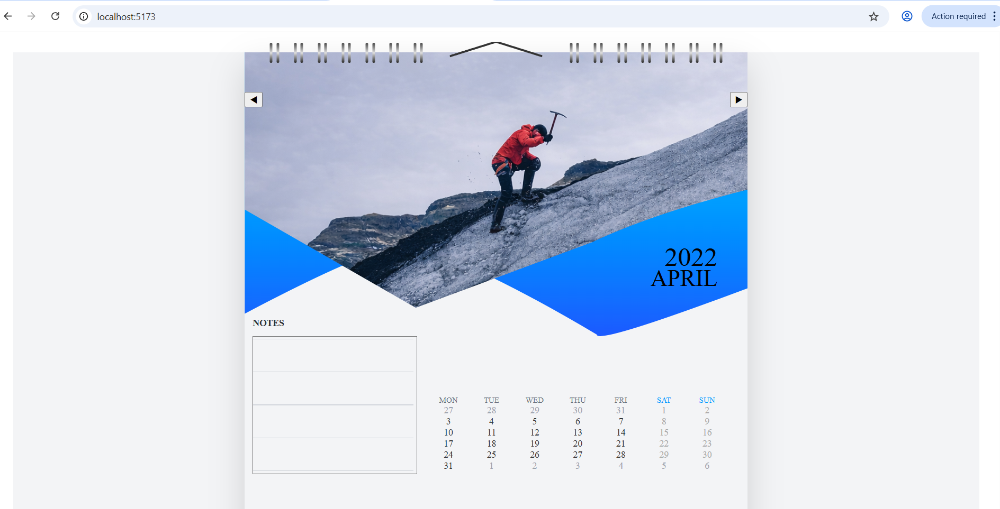

📅 Calendar UI (Interactive Wall Calendar)

An interactive and visually appealing wall calendar built using React, TypeScript, and Tailwind CSS.

---

✨ Features

- 📆 Monthly calendar view
- 🔄 Next & Previous month navigation
- 🎨 Custom modern UI design
- 📝 Notes section
- 🎯 Weekend highlighting
- 📱 Responsive layout

---

🛠️ Tech Stack

- React
- TypeScript
- Tailwind CSS
- date-fns

---

📂 Project Structure

src/
 ├── components/
 │    ├── CalendarCard.tsx
 │    ├── DateGrid.tsx
 │    ├── HeroSection.tsx
 │    ├── NotesSection.tsx
 │
 ├── App.tsx
 ├── main.tsx

---

🚀 How to Run Locally

npm install
npm run dev

---

📸 Preview

---

🔗 GitHub Repository

https://github.com/shweta-dwivedi-1385/Calender-UI

---

📌 Future Improvements

- Date selection feature
- Event/Reminder system
- Backend integration
- User authentication

---

👩‍💻 Author

Shweta Dwivedi